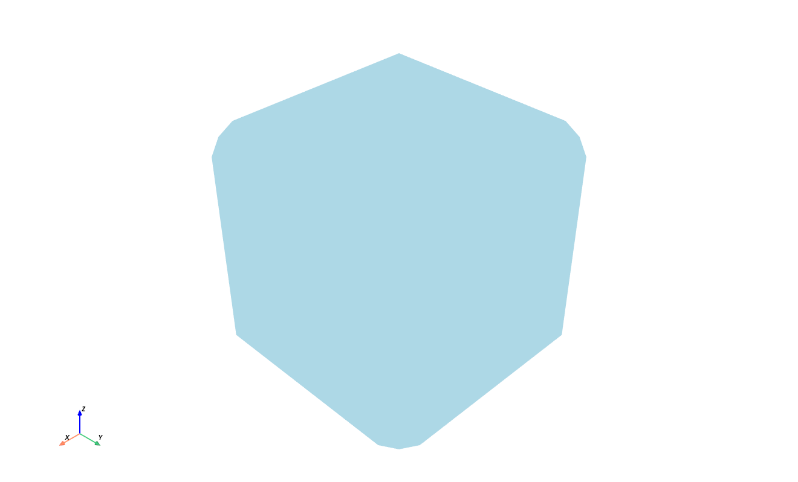

# Phase 3A.1 Report

Phase 3A.1 fixes the release-blocking Windows GUI runtime defect where Estimate
or Preview could produce a blank white/unresponsive GUI during real interactive
use.



## Root Cause

Two Phase 3A implementation choices made the Windows runtime fragile:

1. `gui.app` forced `PYVISTA_OFF_SCREEN=true` for all launches. That is useful
   for CI, but wrong for an interactive PyVistaQt renderer. It could push VTK
   into an offscreen render path while the user expected an embedded Qt widget.
2. Process workers used a generic callable/args wrapper with limited lifecycle
   diagnostics. When Windows spawn behavior or worker exit handling failed, the
   GUI could remain busy or blank without enough information to diagnose the
   child process.

## Fix

- Removed forced offscreen rendering from normal app launch.
- Added `--debug-gui` mode and structured JSON-lines diagnostics.
- Added `multiprocessing.freeze_support()` to the GUI entry point.
- Reused `QApplication.instance()` instead of constructing unconditionally.
- Refactored workers to spawn-safe pure child-process job functions.
- Added child PID, parent PID, thread ID, exit code, event, worker type, and run
  ID to diagnostics.
- Ensured child processes return only compact scalar metrics and artifact paths.
- Added unexpected-exit and timeout handling.
- Added explicit PyVistaQt actor creation logging and render calls.
- Added clean shutdown behavior that cancels active workers and closes the
  preview viewer.
- Added a Windows GUI smoke script.

## Affected Files

- `src/porous_designer/gui/app.py`
- `src/porous_designer/gui/diagnostics.py`
- `src/porous_designer/gui/application_controller.py`
- `src/porous_designer/gui/main_window.py`
- `src/porous_designer/gui/panels/preview_panel.py`
- `src/porous_designer/gui/workers/*.py`
- `scripts/windows_gui_smoke.py`
- `tests/gui/test_phase_3a_gui.py`

## Before Behavior

- Interactive launch forced `PYVISTA_OFF_SCREEN=true`.
- Worker failures could be difficult to distinguish from GUI hangs.
- Preview rendering had no actor-count logging.
- Worker imports/tests did not prove that no GUI objects were created in child
  imports.

## After Behavior

- Estimate runs synchronously, creates no top-level window, and populates the
  embedded feasibility panel.
- Preview starts a child process, returns a preview STL path, and loads it on
  the GUI thread.
- Embedded preview actor count is logged.
- Cancellation and unexpected child exits restore GUI state.
- Importing worker modules does not create a QApplication or top-level widgets.

## Windows Interactive Smoke Result

Command:

```powershell
python -X faulthandler scripts\windows_gui_smoke.py
```

Result:

- Estimate: `feasible`, grid `(5, 5, 5)`
- GUI PID: `56164`
- Preview worker PID: `76640`
- Preview worker exit code: `0`
- Preview STL:
  `runs/284db9c9-bd5f-4d07-abdf-b540a1447efa/geometry/windows_gui_smoke.preview.stl`
- Renderer actor count: `2`
- Screenshot: `docs/phase_3a1_windows_smoke.png`

A non-terminating Windows COM/RPC faulthandler line appeared while inside the Qt
event loop. The application did not crash, the worker exited cleanly, the actor
was created, and the process returned exit code `0`.

## Tests

Phase 3A.1 adds coverage for:

- app import safety
- worker import safety
- no second QApplication
- Estimate top-level widget stability
- Estimate error recovery
- preview child-process execution
- artifact-path return contract
- GUI heartbeat responsiveness during preview
- preview failure reporting
- unexpected child exit handling
- cancellation recovery
- close-window worker termination
- repeated Estimate/Preview calls

## Remaining Limitations

- Backend stage progress is still coarse; exact percentages are not available.
- The manual smoke script is the primary real-display check. CI/offscreen tests
  still use the fallback QLabel path for stability.
- The non-terminating faulthandler COM/RPC line should be monitored on other
  Windows machines but did not block the fixed workflows.
