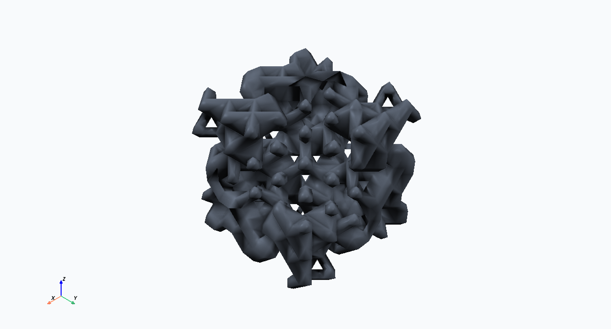

# Phase 3A.2 Report

Phase 3A.2 improves scientific 3D visualization quality and GUI usability. It
does not change geometry generation, STL export, porosity tuning, validation
thresholds, or scientific run results.

## Before And After

Baseline gyroid rendering:


Scientific preset:


Light Background preset:



## Confirmed Causes Of Poor Visibility

- PyVista default pale-blue material on white background had low depth contrast.
- Smooth display normals were not explicitly generated for STL display.
- Lighting relied on uncertain defaults.
- Ambient/depth cues were not configured.
- Camera padding and projection were weak.
- Clipping controls existed but did not update the rendered mesh.
- The expanded GUI controls could squeeze the render widget without a minimum
  viewer height.

## Renderer Settings

| Setting | Before | Scientific preset |
| --- | --- | --- |
| Mesh color | pale blue default | neutral gray `#9ca3af` |
| Background | white | dark charcoal `#111827` |
| Projection | default | perspective |
| Smooth shading | default/off | on |
| Edges | default/off | off |
| Ambient | default | 0.14 |
| Diffuse | default | 0.78 |
| Specular | default | 0.22 |
| Specular power | default | 22 |
| Lighting | default | 3-light key/fill/rim rig |
| Anti-aliasing | not configured | FXAA when supported |
| Ambient occlusion | not configured | SSAO or eye-dome fallback when supported |

## Active Lighting

The embedded renderer recreates three scene lights:

- key light: `(3, -4, 5)`, intensity `0.95`
- fill light: `(-4, 3, 2)`, intensity `0.35`
- rim/back light: `(0, 5, 5)`, intensity `0.55`

Lights are recreated on scene refresh so repeated preview loads do not
accumulate duplicate lights.

## Image Metrics

| Image | Size | Luminance std. dev. | Mean luminance |
| --- | ---: | ---: | ---: |
| Before gyroid | 1320 x 798 | 21.39 | 242.43 |
| Scientific gyroid | 1280 x 690 | 32.37 | 39.36 |
| Light Background gyroid | 1280 x 690 | 72.59 | 216.83 |

The new presets are more visually separated from the background and show many
more sampled color bands than the baseline.

## Performance

Measured on the gyroid visual smoke fixture:

| Stage | Time |
| --- | ---: |
| STL load | 0.023 s |
| Display-normal calculation | 0.0049 s |
| Actor/render refresh | 0.022 s |

Normals are cached for the active preview mesh and are not recomputed on camera
interaction.

## Windows Interactive Smoke

Commands:

```powershell
python -X faulthandler scripts\windows_gui_visual_smoke.py --family gyroid --preset Scientific --output docs\phase_3a2_after_gyroid_scientific.png
python -X faulthandler scripts\windows_gui_visual_smoke.py --family gyroid --preset "Light Background" --output docs\phase_3a2_after_gyroid_light.png
```

Results:

- Scientific actor count: `2`
- Light Background actor count: `2`
- Scientific preview child PID: `57020`
- Light Background preview child PID: `78760`
- preview child processes exited successfully
- screenshots were nonuniform and contained rendered geometry

As in Phase 3A.1, faulthandler printed a non-terminating Windows COM/RPC line
inside the Qt event loop. The application returned success.

## GUI Usability Fixes

- Left panel minimum width and form wrapping were improved to avoid clipped
  labels at normal Windows scaling.
- Validation table columns now have useful default widths, tooltips, formatted
  units, row copy, and CSV export.
- Screenshot export writes a JSON sidecar with rendering preset, camera,
  projection, mesh path, and timestamp.

## Verification

- GUI tests: `29 passed`
- Unit tests: `39 passed`
- Generator integration tests: `6 passed`
- Federica regression: `3 passed in 5:48`
- Windows visual smoke: passed for Scientific and Light Background presets
- Geometry generation code unchanged

## Remaining Limitations

- Ambient occlusion support depends on the local VTK/OpenGL backend.
- Offscreen CI tests cannot fully validate GPU-specific lighting behavior.
- Transparency is visualization-only and may vary by GPU; depth peeling is
  enabled defensively when available.
