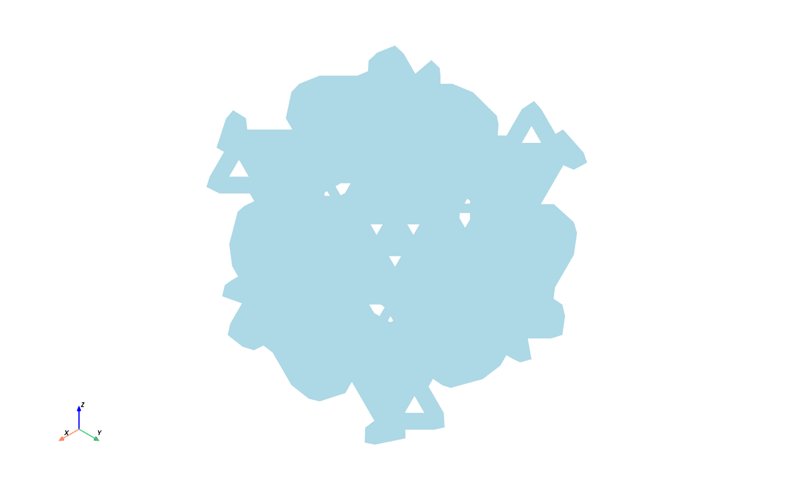
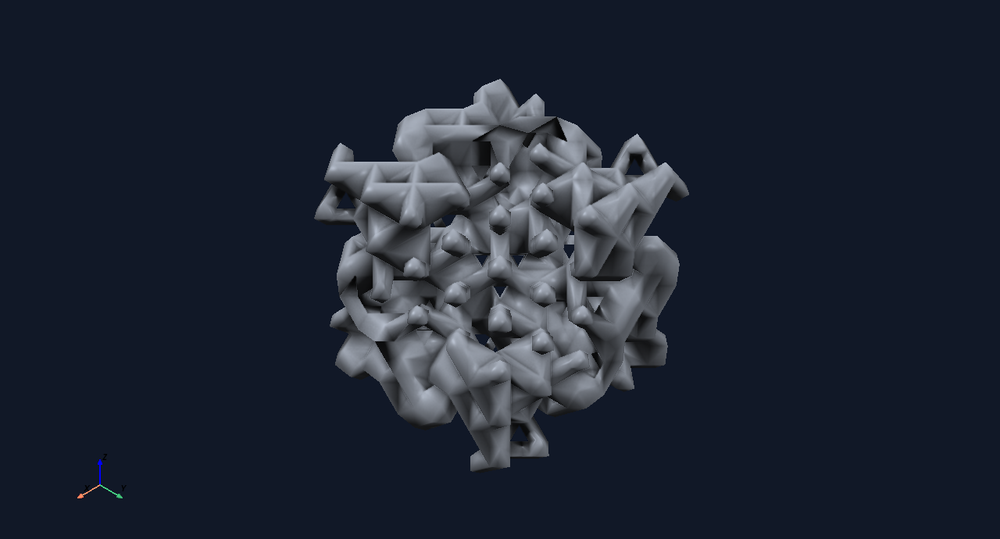
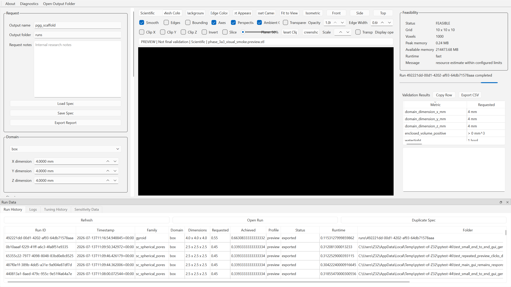
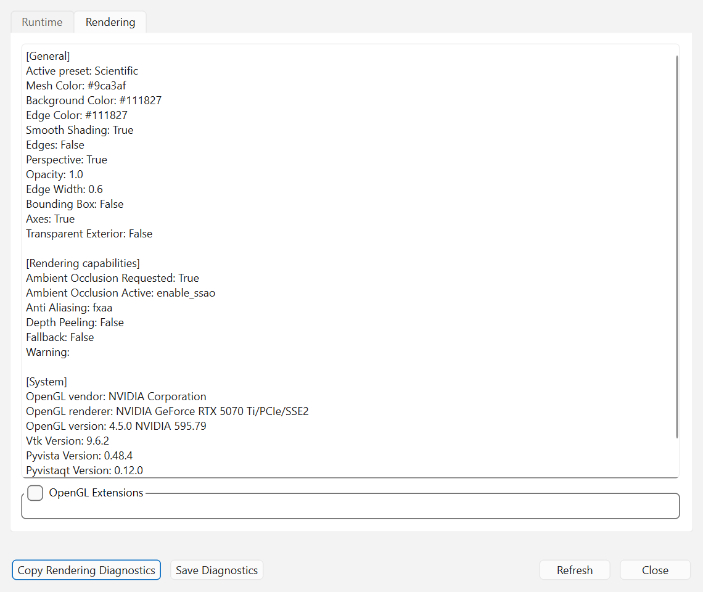
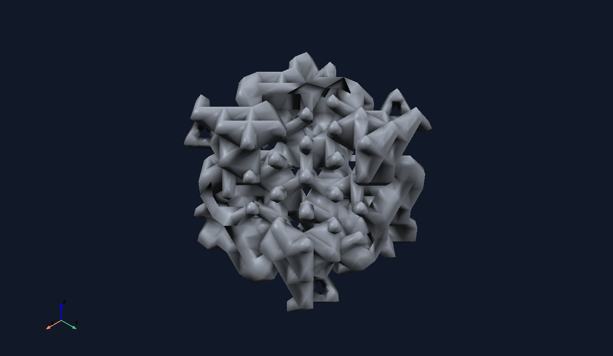

# Phase 3A.3 Report

Phase 3A.3 cleans the preview layout and moves renderer diagnostics into the
Diagnostics dialog. It does not change geometry generation, STL export,
porosity tuning, validation metrics, display-normal generation, or scientific
reports.

## Before And After

Before cleanup, the preview panel displayed a multi-line renderer diagnostics
block above the viewport. That block included preset, colors, rendering feature
state, OpenGL renderer information, and potentially long OpenGL capability
text.

After cleanup, the normal preview panel shows one compact status row:

```text
PREVIEW | Not final validation | Surface + Edges | <mesh.stl>
```

Detailed renderer information is available through `Diagnostics > Rendering`.

Existing Phase 3A.2 screenshots remain the visual rendering baseline:





Phase 3A.3 cleanup screenshots:





Renderer-only screenshot:



No new scientific rendering algorithm was introduced in Phase 3A.3.

## Viewport Area

The former verbose diagnostics label was removed and no placeholder space is
reserved. The preview status row is fixed-height, and the PyVistaQt viewport is
the stretch item in the preview layout.

Measured automated widget behavior:

| Item | Before | After |
| --- | --- | --- |
| Verbose diagnostics in preview panel | Present | Removed |
| Compact status row | Not isolated | Present |
| Viewport stretch | Below diagnostics label | Main stretch item |
| OpenGL extensions in normal preview | Possible through diagnostics text | Not shown |

Captured image metrics:

| Image | Size | Luminance std. dev. |
| --- | ---: | ---: |
| Renderer screenshot | 1280 x 744 | 33.43 |
| Preview cleanup | 2559 x 1440 | 109.25 |
| Rendering diagnostics | 1140 x 960 | 26.39 |

## Diagnostics Dialog

The Diagnostics action now opens a tabbed dialog:

- `Runtime` for process, Python, Qt, and package context.
- `Rendering` for preset, appearance, renderer feature state, OpenGL fields,
  package versions, and collapsed OpenGL extensions.

The extensions section is collapsed by default and uses a read-only monospaced
text area.

## Windows Scaling

Automated tests confirm labels are present with complete text. Manual display
scaling checks should be run on Windows at:

- 100%
- 125%
- 150%

The acceptance checklist is: no clipped `Reset Appearance` or
`Transparent Exterior` labels, no control overlap, and the viewport retaining
most of the center panel with the Run Data dock open or closed.

## Screenshot Behavior

Default screenshot export still calls the renderer screenshot path. The compact
status row and Diagnostics dialog are ordinary Qt widgets outside the renderer,
so they are excluded from viewport screenshots. The existing JSON sidecar still
records rendering preset and technical metadata.

## Verification

- Compile check passed for edited GUI modules and tests.
- GUI tests: `34 passed`.
- Unit tests: `39 passed`.
- Generator integration tests: `6 passed`.
- Federica regression: `3 passed in 5:41`.
- Windows visual smoke: passed for gyroid Scientific preset with actor count
  `2`.
- Existing visual-regression screenshot tests remain part of the GUI suite.
- Scientific output code was not modified.

## Scientific Output

Phase 3A.3 changed only GUI layout, diagnostics placement, and diagnostics
metadata structure. No backend generation, validation, tuning, or STL export
files were edited.
