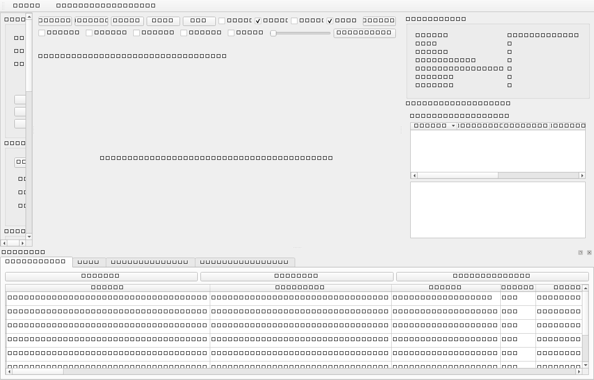

# Phase 3A Report

Phase 3A implements the local desktop GUI for known internal research users.
The deterministic CLI/backend remains the authoritative generation and
validation engine.



## Implemented

- PySide6 desktop application named `PGG, Porous Geometry Generation`.
- Three-region layout: structured controls, preview viewer, and validation data.
- Bottom dock tabs for run history, logs, tuning history, and sensitivity data.
- Structured editor for box/cylinder domains.
- Selectors for SC, BCC, FCC, HCP, gyroid, diamond, and primitive structures.
- Sphere-lattice fields and TPMS fields switch by selected generator.
- Immediate model-backed validation using `DesignSpecification`.
- Resource estimation through the Phase 2 backend estimator.
- Background preview generation and separate-process final generation.
- Cancellation of active background processes.
- Validation table showing requested, achieved, tolerance, status, and method.
- SQLite run history storing only metadata and artifact paths.
- Previous-run opening and specification duplication.
- Deterministic HTML report generation.
- STEP control shown as disabled with explanation.
- Windows launcher: `launch_pgg_gui.bat`.

## Launch Commands

```powershell
porous-designer-gui
python -m porous_designer.gui.app
launch_pgg_gui.bat
```

## Verification

| Suite | Result |
| --- | --- |
| GUI tests | 16 passed |
| Unit tests | 39 passed |
| Generator integration tests | 6 passed |
| Federica regression | 3 passed |

## Small End-to-End GUI Metrics

The GUI test suite runs a small 2.5 x 2.5 x 2.5 mm SC fixture through the
process-backed preview path. It verifies that the UI receives a completion
signal and that the generated STL exists. Normal GUI tests avoid Federica-scale
geometry.

## Responsiveness and Cancellation

Preview and final generation are launched through `ProcessWorker`, which uses a
child process and Qt polling signals. The GUI process remains responsive while
the worker process runs. Cancellation terminates the child process and reports a
structured cancellation event to the GUI. Completed validated artifacts are not
deleted.

## Known Limitations

- The backend does not yet stream fine-grained stage progress, so Phase 3A uses
  stage messages and indeterminate progress for generation.
- PyVistaQt is used when a display backend is available; tests use a safe
  offscreen fallback viewer.
- Wall-thickness and throat-size fields are visible as unsupported measurements.
- Final Federica STL loading is explicit; the GUI does not auto-load large final
  meshes.
- Sensitivity execution is implemented as a worker hook but not surfaced as a
  full dedicated control workflow in this first GUI phase.

## Phase 3B Blockers

- Add a structured progress callback API to the deterministic backend.
- Add richer run-state persistence during mid-generation cancellation.
- Add agent-facing command contracts only after GUI/backend workflows stabilize.
- Design a human-review boundary before any LLM assistant can modify specs.
