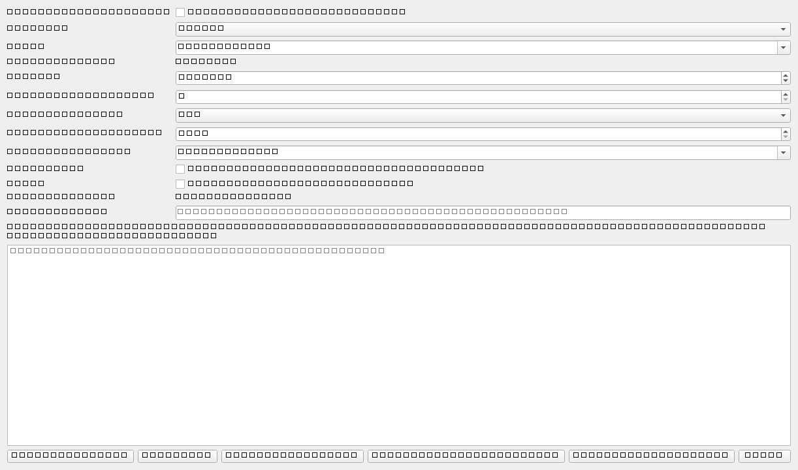

# Phase 3B.1.1 Report

Phase 3B.1.1 adds secure optional OpenAI and Gemini provider integration while
preserving deterministic-first, low-cost-first, human-supervised behavior.

## Commit Baseline

- Phase 3A.3: `a11145c`
- Phase 3B.1: `f4b3ba1`

## Providers



- OpenAI: implemented as optional `OpenAIProvider`
- Gemini: implemented as optional `GeminiProvider`
- Deterministic: remains default
- Mock: retained for automated tests

Default low-cost models:

- OpenAI: `gpt-5.6-luna`
- Gemini: `gemini-3.1-flash-lite`

Escalation:

- OpenAI: `gpt-5.6-terra`, optional only, confirmation required by default

## Security

API keys are discovered from environment variables or OS credential storage via
`keyring`. They are not stored in QSettings, run directories, logs, specs, or
audit files. Error messages and artifacts use redaction.

Provider settings screenshot: `1222 x 720`, luminance std. dev. `35.62`.

## Deterministic Call Policy

The call decision stage can avoid external calls when deterministic parsing is
complete and unambiguous. External access remains disabled by default.

## Evaluation

Deterministic benchmark:

- requests: `40`
- no external call required: `29`
- external-call avoidance rate: `72.5%`
- schema success rate: `100%`
- exact field accuracy on expected-field subset: `100%`
- ambiguity recall: `100%`
- unsupported STEP/STP recall: `100%`
- estimated cost: `$0.00`

OpenAI `gpt-5.6-luna`, Gemini `gemini-3.1-flash-lite`, and OpenAI
`gpt-5.6-terra` were not live-tested in this automated run because no live
provider credentials were used. Mocked provider tests validate request
construction, schema handling, defaults, errors, fallback, cache, and audit.

Recommended production default remains deterministic-only unless a user
explicitly enables external access. After opt-in, the low-cost configured model
is recommended first.

## Cache

Validated provider results can be cached by normalized request, parser version,
provider, model, schema version, and terminology version. Cache hit rate was not
measured against live providers in this run; deterministic evaluation does not
need provider cache.

## Live Test Commands

```powershell
set OPENAI_API_KEY=<configured locally>
pytest -m live_provider --provider openai --model gpt-5.6-luna

set OPENAI_API_KEY=<configured locally>
pytest -m live_provider --provider openai --model gpt-5.6-terra

set GEMINI_API_KEY=<configured locally>
pytest -m live_provider --provider gemini --model gemini-3.1-flash-lite
```

## Limitations

- SDK packages are optional and were not installed in the baseline runtime.
- Live provider quality, latency, token use, and estimated cost require
  explicit credentials and opt-in tests.
- Cancellation is represented in provider error categories and GUI controls;
  full async cancellation ergonomics can be deepened in Phase 3B.2.

## Verification

- Compile check: passed for `src` and `tests`
- Unit tests: `66 passed`
- Agentic plus generator integration: `14 passed`
- GUI tests: `44 passed`
- Federica regression: `3 passed in 5:14`
- Deterministic provider evaluation CLI: passed, `40` benchmark cases
