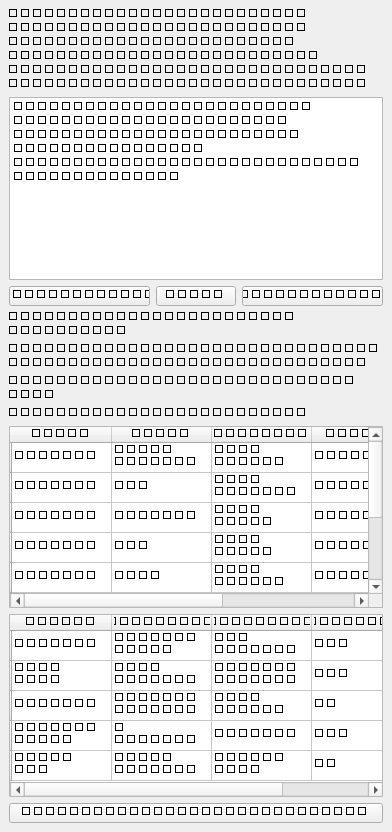

# Phase 3B.1 Report

Phase 3B.1 adds human-supervised natural-language requirement interpretation to
PGG. The deterministic backend and GUI remain authoritative.

## Phase 3A.3 Baseline

Phase 3A.3 was committed separately before this work:

```text
a11145c Clean preview layout and diagnostics Phase 3A.3
```

## Implementation

Added:

- strict parsed-request contracts
- controlled terminology registry
- deterministic parser
- ambiguity detection
- provider-neutral interface
- deterministic-only and mock providers
- disabled external-provider adapter
- proposal/review/approval records
- agentic audit writer
- GUI Agentic Request panel
- specification review and ambiguity dialogs

## Federica Parsing Result



The Federica request extracts:

- box dimensions: `8 x 14 x 8 mm`
- proposed family: `hcp_spherical_pores`, confirmation required
- pore diameter: `1 mm`, confirmation required because source says `pore size`
- porosity range: `0.75-0.80`
- proposed target: `0.775`, confirmation required
- open/interconnected pores: requested
- STL output: accepted
- STEP/STP output: recognized as unsupported and retained as future requirement

Detected ambiguities include hexagonal interpretation, pore-size definition,
connectivity direction, porosity target policy, and STEP/STP handling.

## Human Review

The user reviews proposed fields in a table with:

```text
Field | Current | Proposed | Confidence | Source | Status
```

Fields can be accepted, rejected, or edited. The approved specification is only
applied after explicit approval.

## Privacy

External agent access is disabled by default. The GUI displays a privacy notice
and automated tests do not call external APIs.

## Verification

- New agentic unit tests: `13 passed`
- New agentic integration tests: `8 passed`
- GUI tests with agentic workflow: `39 passed`
- Full unit suite: `52 passed`
- Agentic plus generator integration: `14 passed`
- Federica regression: `3 passed in 5:25`
- Compile check: passed for `src` and `tests`
- Agentic Request panel screenshot: `392 x 832`, luminance std. dev. `65.41`

## Limitations

- External provider transport is intentionally not configured in Phase 3B.1.
- Review table editing is intentionally simple; richer typed editors belong in
  a later phase.
- Feasibility explanation is deterministic-status preserving and minimal.

## Recommended Phase 3B.2

- richer provider configuration UI
- stronger typed editors for proposed fields
- more detailed feasibility explanations
- expanded audit browser in the GUI
- no autonomous generation without explicit user action
