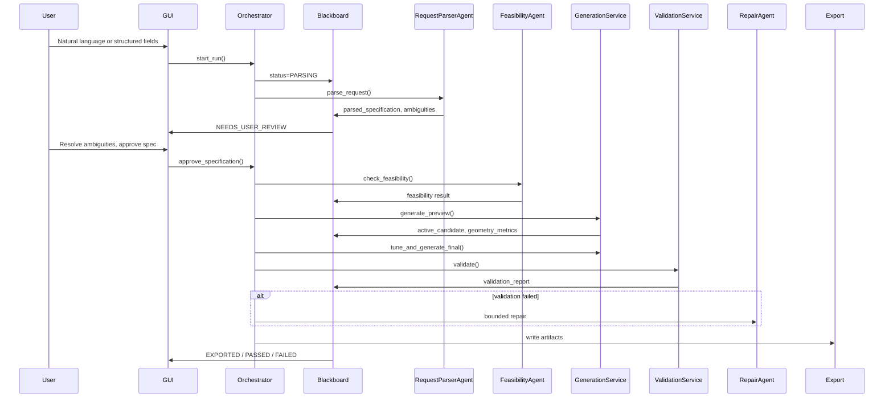

# Proposed Architecture — Porous Structure Designer

## 1. Design goals

1. **Deterministic floor** — all geometry, measurement, and acceptance decisions are reproducible algorithms.
2. **Structured source of truth** — `DesignSpecification` (Pydantic) is authoritative; natural language is input only.
3. **Bounded agents** — LLM assists parsing/explanation; never generates or executes code.
4. **Honest failure** — infeasible requests return explicit status, not silent parameter adjustment.

## 2. Layered architecture

```
┌─────────────────────────────────────────────────────────────┐
│  GUI (PySide6)  │  CLI  │  Optional LLM (Assisted mode)    │
├─────────────────────────────────────────────────────────────┤
│  OrchestrationService  ←→  Blackboard  ←→  StateMachine     │
├─────────────────────────────────────────────────────────────┤
│  Agents: Parser │ Ambiguity │ Feasibility │ Strategy │      │
│          Repair │ Report                                     │
├─────────────────────────────────────────────────────────────┤
│  Services: Generation │ Validation │ History                 │
├─────────────────────────────────────────────────────────────┤
│  Tools Registry (typed, deterministic)                      │
│    geometry │ validation │ export │ rendering                │
├─────────────────────────────────────────────────────────────┤
│  Generators: sphere_lattices │ tpms │ domains               │
│  Tuning: porosity_solver │ feasibility_bounds               │
│  Geometry: voxel │ sdf │ mesh │ occ │ connectivity          │
│  Validation: porosity │ mesh │ thickness │ step │ acceptance │
│  Exporters: stl │ step │ spec │ report                      │
└─────────────────────────────────────────────────────────────┘
```

## 3. Data flow



## 4. Blackboard contract

Single JSON-serializable object persisted after every major transition. Keys match spec section 9. State transitions enforced by `StateMachine` — invalid transitions raise `InvalidTransitionError`.

## 5. Generator registry

| Family | Backend | STEP support | Porosity control |
|--------|---------|--------------|------------------|
| SC/BCC/FCC/HCP sphere pores | voxel → marching cubes; optional gmsh B-Rep | Yes (sphere boolean) | `lattice_spacing_mm` |
| Gyroid/Diamond/Primitive TPMS | SDF voxel → marching cubes | **No** (STL only) | `tpms_level_set` |

## 6. Validation profile

`ValidationReport` aggregates checks from specialized validators. Each check: name, requested, achieved, tolerance, status, severity, method, message.

Hard-fail triggers bounded repair (max 5 engineering refinements, max 2 technical retries per stage).

## 7. LLM adapter

```python
class LLMProvider(Protocol):
    def parse_request(self, text: str, schema: dict) -> ParseResult: ...
    def explain_ambiguities(self, ambiguities: list) -> list: ...
    def recommend_strategy(self, spec, feasibility) -> Strategy: ...
    def recommend_repair(self, failures, allowed_actions) -> RepairAction: ...
    def draft_report(self, blackboard) -> str: ...
```

Default: `NullLLMProvider` — structured-only mode, no API key required.  
Assisted: schema-validated JSON only; one retry on schema failure; fallback to deterministic rules.

## 8. Persistence layout

```
runs/<run_id>/
  approved_specification.yaml
  blackboard.json
  validation_report.json
  report.html
  preview.png
  geometry/scaffold.{stl,step,npz}
  checksums.json
  run.log
  environment.json
```

SQLite index: run metadata only (no mesh blobs).

## 9. Threading model

- GUI thread: panels, state display only.
- `QThread` or `multiprocessing.Process` for generation/validation.
- Progress via blackboard events → Qt signals.
- Cancellation sets blackboard status `CANCELLED`, terminates worker, preserves last valid state.

## 10. Migration from `porousgen.py`

| Current function | Target module |
|------------------|---------------|
| `centers_*` | `generators/sphere_lattices.py` |
| `sphere_solid_grid`, `gyroid_solid_grid` | `geometry/voxel.py` |
| `tune` | `tuning/porosity_solver.py` |
| `grid_to_stl` | `exporters/stl_exporter.py` |
| `build_step` | `exporters/step_exporter.py` |
| `load_spec`, parsers | `domain/specification.py` + legacy adapter |
| `main()` orchestration | `services/orchestration_service.py` |

Algorithms preserved verbatim in Phase 2; refactored into modules with unit tests.

## 11. Technology stack

| Component | Choice | Notes |
|-----------|--------|-------|
| Python | 3.12 primary, 3.14 tested | Document in `environment.yml` |
| GUI | PySide6 6.11+ | cp310-abi3 wheels |
| 3D view | PyVista + vtk | Already have vtk 9.6.1 |
| Schemas | Pydantic v2 | Already installed |
| CAD | gmsh 4.15 OCC | Existing pipeline |
| Logging | structlog | JSON + human console |
| Tests | pytest, pytest-qt | GUI smoke tests |

## 12. Explicit non-goals (this phase)

FEA, permeability, cloud deployment, arbitrary code execution, visual-only validation, universal TPMS STEP export.
